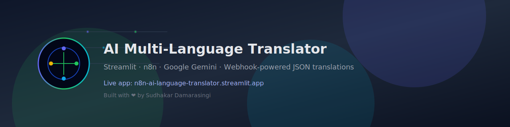

  

  
  
  
  
  
  

---

# 🌐 AI Multi-Language Translator
**Streamlit + n8n + Google Gemini**

Live App: **https://n8n-ai-language-translator.streamlit.app/**
📘 Overview

This project is a full-stack AI translation system that translates text into multiple languages in a single request.
It uses:

Streamlit for the frontend UI

n8n for workflow automation

Google Gemini for translation

Webhooks for communication

JSON for structured output

The translator automatically detects the source language and returns translations in a structured format, which the UI displays in a clean and modern layout.

This project is built as a demonstration of AI automation, LLM integration, and frontend–backend orchestration using low-code tools.

🚀 Features
🔹 Multi-Language Translation (One Request → Many Outputs)

Translate a single input text into any number of languages at the same time.

🔹 Automatic Source Language Detection

User does not need to choose the language they typed.

🔹 Clean Modern UI

Dark theme

Smooth layout

Translation cards

Mobile-friendly

🔹 Structured JSON Output from Gemini

Makes results reliable and easy to use.

🔹 n8n + Webhook Workflow

Backend automation is handled through n8n — scalable and customizable.

🔹 Hosted Live App

Available 24/7 at:
👉 https://n8n-ai-language-translator.streamlit.app/

🧩 Tech Stack
Layer	Technology
Frontend	Streamlit (Python)
Backend Automation	n8n Workflow
AI Model	Google Gemini
Communication	Webhook (JSON)
Deployment	Streamlit Cloud
Styling	Custom CSS in Streamlit
🏗️ Architecture
User → Streamlit UI → n8n Webhook → AI Agent (Gemini) → JSON Translations → Streamlit UI

Explanation:

User enters text and chooses target languages.

Streamlit sends a POST request to the n8n webhook.

n8n triggers an AI Agent node with a dynamic prompt.

Gemini detects source language and translates into all target languages.

Gemini returns output strictly in JSON format.

Streamlit parses the JSON and displays each translation inside styled cards.

📤 n8n Request Structure

Streamlit sends:

{
  "text": "Hello, how are you?",
  "targetLangs": ["Hindi", "Telugu", "French"]
}

📥 Gemini Expected Response (JSON)
{
  "Hindi": "नमस्ते, आप कैसे हैं?",
  "Telugu": "హాయ్, మీరు ఎలా ఉన్నారు?",
  "French": "Bonjour, comment ça va?"
}

n8n wraps this as:

[
  {
    "output": "{\"Hindi\":\"...\",\"Telugu\":\"...\",\"French\":\"...\"}"
  }
]

Streamlit automatically extracts and parses this output.

🔧 n8n Configuration
1. Webhook Node (POST)

URL example:

https://sudha-mad-max-1997.app.n8n.cloud/webhook/cadf0c18-7c71-42cd-b878-894378064406

2. AI Agent Node
System Prompt:
You are a professional translation engine.
Your job is to translate user input into multiple requested target languages.

Rules:
• Auto-detect the source language.
• Return only a JSON object.
• Do not add explanations or comments.
• Keys = language names.
• Values = translated text.

User Prompt (Expression Mode):
{{
"Translate the following text into each of the target languages.\n\n" +
"Text: " + $json.body.text + "\n\n" +
"Target languages (JSON array): " + JSON.stringify($json.body.targetLangs) + "\n\n" +
"Return the translations strictly as a minified JSON object where each key is the language name and each value is the translation.\n" +
"Example: {\"Hindi\":\"नमस्ते\",\"Telugu\":\"హాయ్\"}\n" +
"Do not add any explanation or extra text."
}}

This ensures predictable JSON output.

🖥️ Streamlit Frontend

The app:

Takes user text input

Allows selecting multiple languages

Sends request to n8n

Parses JSON response

Displays translations in two columns

Includes a footer with credits

Live App Link

👉 https://n8n-ai-language-translator.streamlit.app/

📦 Installation (Local)
1. Clone the Repo
git clone https://github.com/<your-username>/<repo-name>.git
cd <repo-name>

2. Install Dependencies
pip install -r requirements.txt

3. Run the App
streamlit run app.py

📸 Screenshots (Add these later)

You can add:

Home screen

Translation example

Multi-language results

n8n workflow screenshot

🧪 Testing

Try English → Hindi, Telugu

Try Hindi → French, Spanish

Try Telugu → Arabic

Try long sentences and paragraphs

Validate JSON integrity

🔮 Future Enhancements

Text-to-speech for all translations

Speech input

Source language display

Translation history

Export to PDF / CSV

Add more target languages

Mobile app version

👨‍💻 Author

Sudhakar Damarasingi
AI/ML & Automation Developer
Built with ❤️ using Streamlit, n8n, and Google Gemini

Live App:
👉 https://n8n-ai-language-translator.streamlit.app/
